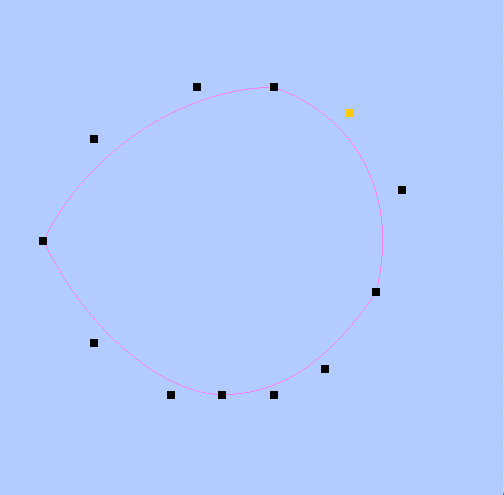
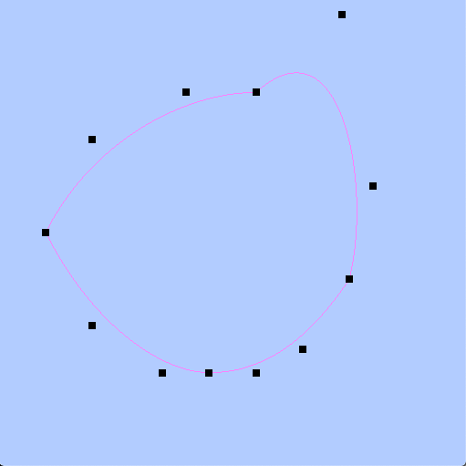
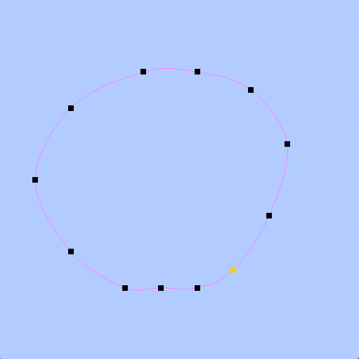
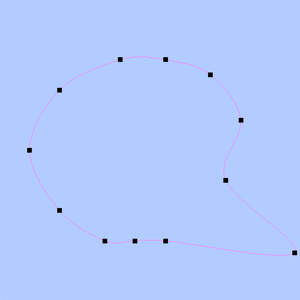
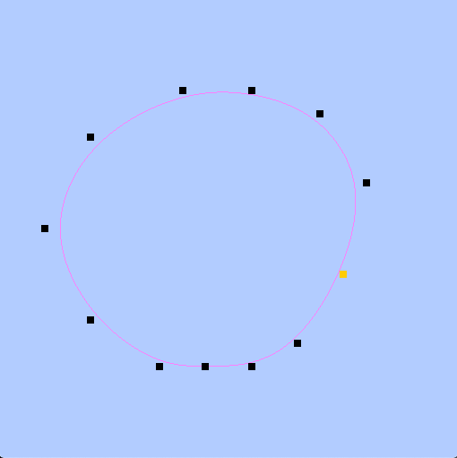
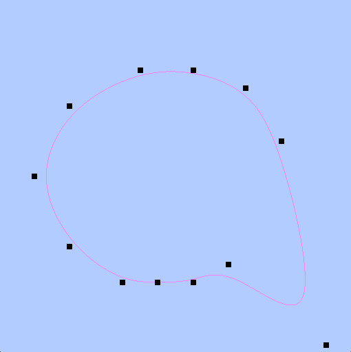
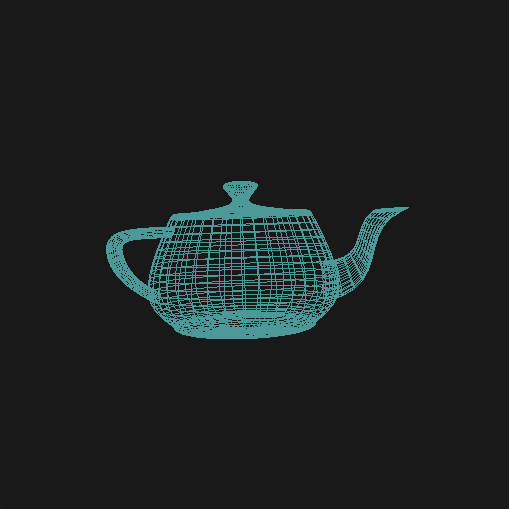
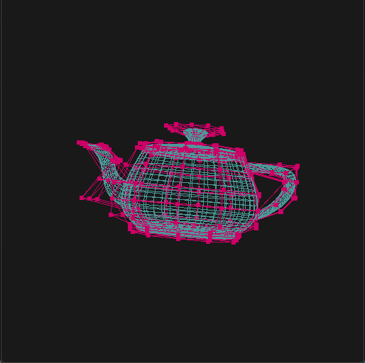
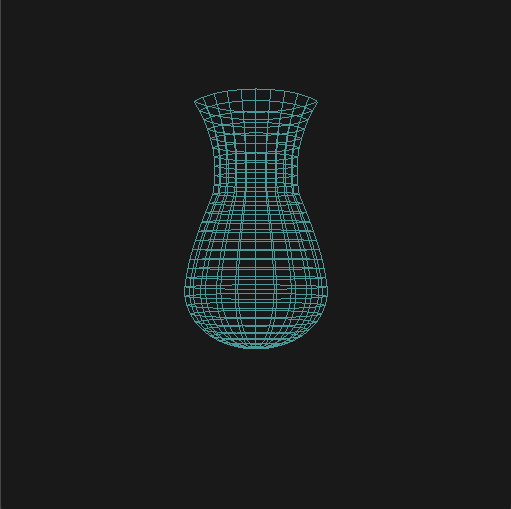
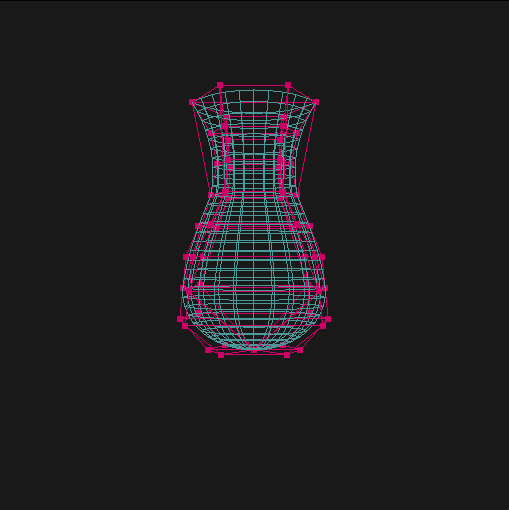

# General
- For the Computer Graphics we had a couple assignments involving the use of splines and 
patches.
- The programs I wrote were in C++ and openGL

# Splines
- For the first assignment we were tasked with implementing:
    - Hermite Spline
    - Catmull-ROM Spline
    - B-Spline
- The same 12 control points were used to easily distinguish the different curves. Each 
control point could be selected (orange) and moved to a different location to see how the 
curve is shaped by the control points.

## Hermite Spline
- Top Image:
    - It can be seen that the hermite spline is calculated with respect to 4 control points, there are 4 separate splines being calculated in this image (can see the start and 
    end where the lines intersect with the control points).
    - You can see in the output below, the left is the original hermite spline where one control point is orange (which is the control point that will be moved). 
- Bottom Image:
    - The control point was moved and it can be seen that the spline changes with respect to 
    4 control points.

 

## Catmull Splines

## B-Spline

 

# Bicubic Patch
- For the subsequent assignment, we were tasked with implementing a Bicubic Patch to 
output the infamous Newell Teapot, as well as an object of our own creation.
- In this program the control points can be toggled on and off by pressing 'z', as can be 
seen comparing the right and left images (right shows the control points from which the 
curve is shaped).
- Rotated in the x, y and z axes using mouse

## Teapot Output
- The teapot is implemented using 32 patches of 16 control points
- Teapot data obtained from John Braico, original source it was adapted was from:
    - Newell's Utah teapot (with bottom): https://github.com/rm-hull/newell-teapot

 

## Vase Output
- The vase I implemented uses 6 patches of 16 control points

 

# Sources
John Braico - Computer Graphics Professor